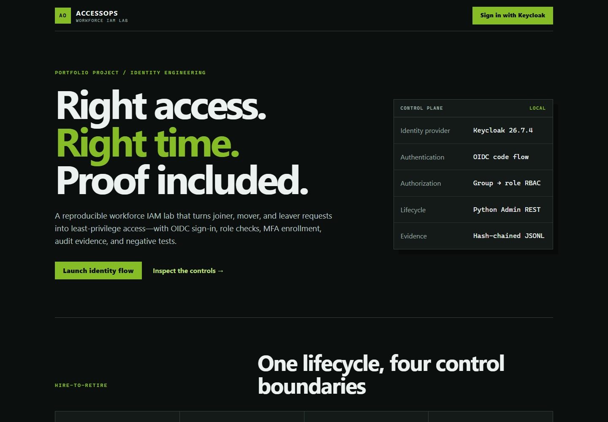
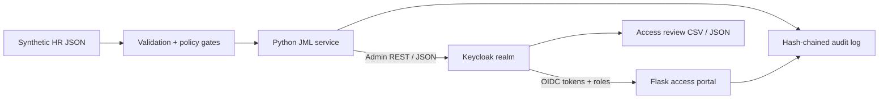

# AccessOps — Workforce IAM Lifecycle Lab

AccessOps is a beginner-friendly but substantive identity and access management project. It turns synthetic HR change requests into controlled **joiner, mover, and leaver** actions in Keycloak, protects a Flask portal with **OpenID Connect**, maps groups to **least-privilege roles**, requires **TOTP enrollment** for privileged access, and produces reviewable audit evidence.

> Portfolio learning project. It is not affiliated with Deloitte, Keycloak, or Okta, and it does not claim production IAM/PAM product ownership.



## Why this project

The project was designed against the public [Deloitte Identity and Access Management Engineer requisition](https://middleeastjobs.deloitte.com/careersME/PipelineDetail/Egypt-Deloitte-Innovation-Hub-I-Cyber-Security-I-Identity-and-Access-Management-Engineer-Cairo-Egypt/253425). That role calls for IAM implementation, REST/JSON, OAuth, Python, testing, troubleshooting, operations, and knowledge transfer. Deloitte's own [Digital Identity](https://www.deloitte.com/global/en/services/risk-advisory/services/digital-identity-by-deloitte.html) material emphasizes Hire-to-Retire lifecycle controls, SSO/MFA, least privilege, audit, and automation.

Keycloak is used as a free local standards-based identity provider so anyone can reproduce the lab. [Okta is one of Deloitte's listed identity alliance technologies](https://www.deloitte.com/us/en/services/consulting/services/digital-identity-services.html), so the design stays provider-neutral and includes an [Okta migration map](docs/OKTA_MIGRATION.md).

## What the lab proves

- **Authentication:** Keycloak performs OIDC authorization-code sign-in.
- **Authorization:** group membership becomes realm roles; Flask routes enforce those roles.
- **Joiner:** a reviewed JSON request creates one synthetic user with the minimum department groups.
- **Mover:** obsolete groups are removed before the new baseline is added.
- **Leaver:** managed groups are removed, the user is disabled, and active sessions are revoked.
- **Governance:** self-approval and conflicting requester/approver access are blocked.
- **Reliability:** event IDs make retries idempotent instead of duplicating users or access.
- **Evidence:** every decision records safe before/after state in a SHA-256 hash chain.
- **Review:** a CSV/JSON access review flags privileged identities and policy exceptions.



## Verified result

The primary Windows/Java profile was executed locally on 23 September 2026:

- Keycloak 26.7.4 started on Java 17 and imported the `accessops` realm.
- The restricted automation service account authenticated and read the realm through Admin REST.
- OIDC login displayed Nour's signed identity and the roles `portal-user` and `ticket-reader`.
- The helpdesk route returned **ALLOW**; the IAM-admin route returned a visible **403** and wrote a denial event.
- Nadia's joiner → mover → leaver scenario preserved one immutable identity ID, removed old Finance access, added Operations access, then disabled the identity and removed all managed groups.
- The deliberate self-approval request was rejected before any identity was created.
- The final audit chain verified as valid.
- All automated tests and lint checks passed. See [verification evidence](evidence/verification-report.md).

## Start here

Requirements: Windows PowerShell, Python 3.11+, Java 17+, and about 500 MB of free disk space. Docker is **not** required for the verified path.

```powershell
# 1. Create an isolated Python environment and generate uncommitted local secrets.
.\scripts\setup-python.ps1

# 2. Download Keycloak 26.7.4 and verify its published SHA-256 digest.
.\scripts\install-keycloak.ps1

# 3. Keep this terminal open. It runs the local identity provider.
.\scripts\start-keycloak.ps1
```

Open a second PowerShell terminal in the project directory:

```powershell
# 4. Define the managed user attributes and verify the automation account.
.\.venv\Scripts\python.exe .\scripts\configure_realm.py

# 5. Keep this terminal open. It runs the OIDC-protected portal.
.\scripts\start-portal.ps1
```

Open `http://127.0.0.1:5000`, sign in with the fictional `nour.helpdesk` account from the realm file, and test one allowed route plus one denied route.

Then open a third terminal for the lifecycle story:

```powershell
.\.venv\Scripts\python.exe .\scripts\lifecycle.py .\requests\04-rejected-self-approval.json
.\.venv\Scripts\python.exe .\scripts\lifecycle.py .\requests\01-joiner.json
.\.venv\Scripts\python.exe .\scripts\lifecycle.py .\requests\02-mover.json
.\.venv\Scripts\python.exe .\scripts\lifecycle.py .\requests\03-leaver.json
.\.venv\Scripts\python.exe .\scripts\access_review.py
.\.venv\Scripts\python.exe .\scripts\verify_audit.py
.\.venv\Scripts\python.exe -m pytest
```

For every click and command—including what it does, how it works, why it exists, expected evidence, and recovery steps—follow the [beginner walkthrough](docs/BEGINNER_WALKTHROUGH.md).

## Demo identities

All data is fictional and restricted to the reserved `example.test` domain.

| Identity | Baseline | Demonstration |
| --- | --- | --- |
| `nour.helpdesk` | `portal-user`, `ticket-reader` | Successful login, allowed tickets, denied IAM admin |
| `dina.auditor` | `portal-user`, `iam-admin`, `auditor` | Privileged access with required TOTP enrollment |
| `nadia.hassan` | Created by the scenario | Joiner → mover → disabled leaver |

The local-only demo passwords are visible in [the realm configuration](keycloak/accessops-realm.json). Never reuse them anywhere else.

## Repository map

```text
accessops/                 Policy, provider, lifecycle, review, and audit services
keycloak/                  Reproducible realm configuration
portal/                    OIDC Flask app and responsive UI
requests/                  Synthetic approved and rejected change requests
scripts/                   Setup, configuration, lifecycle, review, and verification tools
tests/                     Positive and negative automated checks
docs/                      Walkthrough, design, runbook, research, and interview guide
evidence/                  Sanitized sample and verification summary; live logs stay ignored
compose.yaml               Optional, unverified-on-this-PC container profile
```

## A 45-second phone explanation

> I built a small workforce IAM lifecycle lab around a common client problem: access becoming wrong during onboarding, transfers, and offboarding. I used Keycloak locally as a reproducible standards-based identity provider, a Python service to automate joiner, mover, and leaver changes through REST and JSON, and a Flask portal secured with OIDC. Group membership drives least-privilege roles, privileged access requires TOTP enrollment, mover access is removed before replacement access is added, and leavers are disabled with sessions revoked. I added negative tests, idempotent retries, an access review, and a tamper-evident audit trail. It is a learning lab—not a claim of production SailPoint, CyberArk, or Okta experience—but it exercises the implementation, testing, troubleshooting, and operations habits in the role.

The shorter and longer versions are in the [hiring-manager guide](docs/HIRING_MANAGER_GUIDE.md).

## Honest boundaries

This is a local development lab using synthetic data, HTTP loopback, Keycloak's development database, and a bootstrap administrator. It is not production-ready and is not a PAM vault, HR integration, SCIM deployment, AD environment, or proof of commercial-platform ownership. Production next steps are documented in [architecture and limitations](docs/ARCHITECTURE.md).

## Documentation

- [Beginner walkthrough](docs/BEGINNER_WALKTHROUGH.md)
- [Architecture and design decisions](docs/ARCHITECTURE.md)
- [Deloitte requirement-to-evidence map](docs/CONTROL_MATRIX.md)
- [Troubleshooting and hyper-care runbook](docs/RUNBOOK.md)
- [Research and primary sources](docs/RESEARCH.md)
- [Okta migration map](docs/OKTA_MIGRATION.md)
- [Hiring-manager phone and demo guide](docs/HIRING_MANAGER_GUIDE.md)
