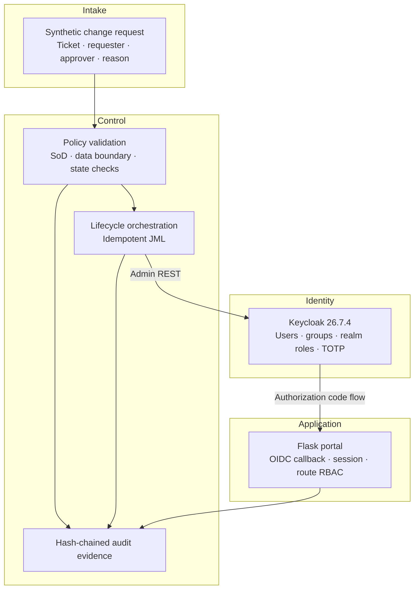
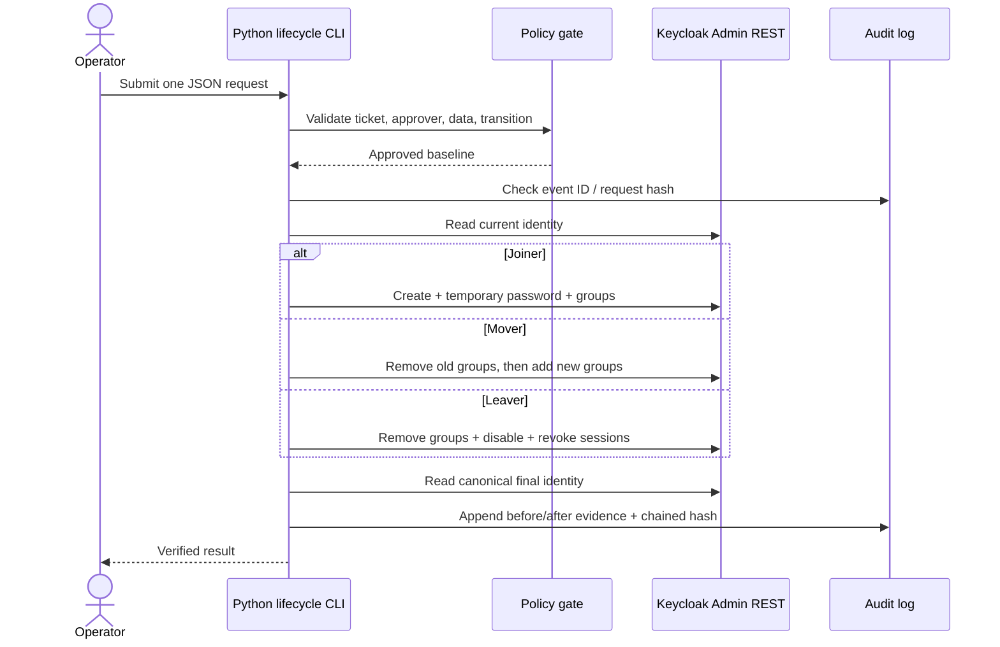

# Architecture and design decisions

## Business problem

Workforce access becomes risky when a joiner receives too much access, a mover keeps access from the old job, or a leaver remains enabled. AccessOps models one controlled Hire-to-Retire path and makes each decision observable.

## Component view

## Identity model

| Department baseline | Keycloak groups | Effective realm roles |
| --- | --- | --- |
| Helpdesk | `Employees`, `Helpdesk` | `portal-user`, `ticket-reader` |
| IAM Operations | `Employees`, `IAM-Operations` | `portal-user`, `iam-admin`, `auditor` |
| Finance Requesting | `Employees`, `Finance-Requesters` | `portal-user`, `finance-requester` |
| Finance Approval | `Employees`, `Finance-Approvers` | `portal-user`, `finance-approver` |
| Operations | `Employees`, `Operations` | `portal-user`, `operations-user` |

The application never assigns authorization directly. Keycloak groups grant realm roles, and the OIDC token carries those roles to the portal.

## Lifecycle sequence

## Why these choices were made

### Keycloak instead of a custom login system

- **Action:** delegate authentication, tokens, roles, sessions, and TOTP to an identity provider.
- **Why:** writing authentication from scratch would demonstrate the wrong engineering instinct.
- **Purpose:** learn standard IAM integration through OIDC and Admin REST.
- **Boundary:** Keycloak is a standards-based stand-in; it is not presented as a Deloitte-listed vendor platform.

### Keycloak instead of Okta as the default

- **Action:** keep the runtime local and add a provider-neutral migration document.
- **Why:** an Okta Integrator Free Plan requires an eligible signup and was not available as a confirmed project input.
- **Purpose:** make the repository reproducible for a reviewer without an external tenant.
- **Boundary:** Okta remains the strongest phase-two provider because it is named in the role and Deloitte alliance material.

### Groups before roles

- **Action:** assign users to business groups; let groups grant roles.
- **Why:** business membership is easier to review than one-off direct role assignments.
- **Purpose:** demonstrate scalable RBAC and reduce entitlement drift.

### Remove before add during a mover

- **Action:** delete obsolete managed groups before attaching the new baseline.
- **Why:** the user should not temporarily hold both old and new business access.
- **Purpose:** enforce least privilege throughout the change, not only at the end.

### Service account for lifecycle automation

- **Action:** use `client_credentials` with a dedicated Keycloak client and user-management roles.
- **Why:** embedding a human administrator username/password in every automation call would be harder to control and audit.
- **Purpose:** model machine identity and scoped API access.

### Hash-chained JSONL evidence

- **Action:** each audit row includes the previous row's hash and its own hash.
- **Why:** edits to earlier evidence become detectable.
- **Purpose:** teach evidence integrity without pretending a local file is immutable SIEM storage.

## Security boundaries

- Loopback HTTP and Keycloak `start-dev` are for local learning only.
- The built-in H2 database is disposable and not a production datastore.
- The committed user passwords are fictional local-demo credentials.
- Generated client/admin secrets stay in ignored `.env`.
- Custom profile attributes are administrator-only and explicitly defined.
- The audit chain detects modification but does not prevent deletion or re-signing by someone who controls the host.
- No real identities, employer data, API keys, HR feeds, or customer tickets are used.

## Production next steps

1. TLS everywhere and a trusted reverse proxy.
2. PostgreSQL with backups and migration controls.
3. Secret manager or workload identity instead of `.env`.
4. Fine-grained admin permissions for the automation client.
5. Signed HR event ingestion, durable queueing, retries, and dead-letter handling.
6. SIEM forwarding and protected retention.
7. Real approval workflow and access-certification ownership.
8. SCIM/AD/cloud-directory connectors and vendor-specific implementation.
9. High availability, metrics, alerting, threat modeling, and recovery testing.

